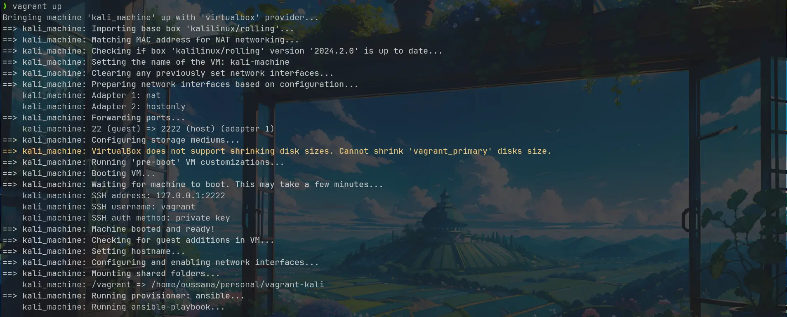
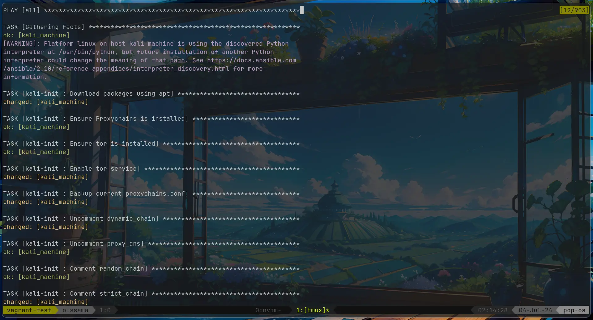
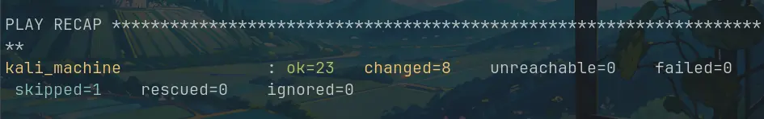

Tired of the repetitive process of setting up a new Linux virtual machine for pen testing? Do you ever find yourself creating snapshots to avoid configuration mistakes, only to forget to do so and end up reinstalling everything? This blog post introduces you to Vagrant and Ansible, a powerful combination that lets you automate VM provisioning and configuration, saving you time and frustration.

**Disclaimer:** This guide is designed for users with GNU/Linux(akshually) based systems who are familiar with basic command-line operations. 

**Prerequisites:**
* A computer running Debian, Ubuntu, or a similar GNU/Linux distribution.
* An internet connection.

**What We'll Build:**
	We'll create a Vagrantfile to define our virtual machine configuration and an Ansible playbook to automate the installation of essential pen testing tools on a Kali Linux VM.

### Installation

**1. Vagrant:**

```bash
wget -O- https://apt.releases.hashicorp.com/gpg | sudo gpg --dearmor -o /usr/share/keyrings/hashicorp-archive-keyring.gpg
echo "deb [signed-by=/usr/share/keyrings/hashicorp-archive-keyring.gpg] https://apt.releases.hashicorp.com $(lsb_release -cs) main" | sudo tee /etc/apt/sources.list.d/hashicorp.list
sudo apt update && sudo apt install vagrant
```

**2. Ansible:**

```bash
sudo apt update
sudo apt install software-properties-common
sudo add-apt-repository --yes --update ppa:ansible/ansible
sudo apt install ansible
```

**3. VirtualBox:**

```bash
sudo apt update
# Uncomment the line corresponding to the desired VirtualBox version:
# Older version
# sudo apt install virtualbox

# Latest version (at the time of writing)
# sudo apt install virtualbox-7.0
```

**Alternative Installation Methods:**

While these instructions cover Debian/Ubuntu, you can find installation guides for other operating systems on the official websites of Vagrant, Ansible, and VirtualBox:

* Vagrant: [https://developer.hashicorp.com/vagrant/install](https://developer.hashicorp.com/vagrant/install)
* Ansible:[https://docs.ansible.com/ansible/latest/installation_guide/intro_installation.html](https://docs.ansible.com/ansible/latest/installation_guide/intro_installation.html)
* VirtualBox: [https://www.virtualbox.org/wiki/Downloads](https://www.virtualbox.org/wiki/Downloads)

### Getting Started

We'll use Vagrant and Ansible to provision a Kali Linux virtual machine for pen testing. 

**1. Initialize the Project:**

First, create a new directory for your project and navigate to it:

```bash
mkdir vagrant_kali
cd vagrant_kali
```

or a use my oneliner:
```bash
mkcd vagrant_kali
```

> **Tip of the Day:**
> 
> The `mkcd` function is a handy shortcut that creates a directory and changes the directory in one step. You can add this function to your `~/.bashrc` or `~/.zshrc` file for future use:
> 
> ```bash
> mkcd () {
>   mkdir -p -- "$1" && cd -P -- "$1"
> }
> ```

Now, initialize the project with Vagrant:

```bash
vagrant init kalilinux/rolling
```

This command creates a `Vagrantfile` pre-populated with comments and examples.

**2. Understanding Vagrant Boxes:**

A Vagrant box is a pre-configured virtual machine image.  We'll use the `kalilinux/rolling` box, which provides a ready-to-use Kali Linux installation. You can search for boxes for different operating systems on the [HashiCorp's Vagrant Cloud box catalog](https://vagrantcloud.com/boxes/search).

**3. Vagrantfile Breakdown:**
```ruby
Vagrant.configure("2") do |config|
  config.vm.box = "kalilinux/rolling"
  config.vm.box_version = "2024.2.0"
  config.vm.network "private_network", ip: "192.168.56.10"
  config.vm.hostname = "machine"
  config.ssh.insert_key = false
  config.vm.disk :disk, size: "35GB", primary: true

  config.vm.provider "virtualbox" do |v|
	# set up vm name in virtualbox
    v.name = "kali-machine"
    # Display the VirtualBox GUI when booting the machine
    v.gui = true
    v.memory = 8192
    v.cpus = 6
  end

  # Set the name of the VM. See: http://stackoverflow.com/a/17864388/100134
  config.vm.define :kali_machine do |kali_machine|
  end

# Ansible config
  config.vm.provision "ansible" do |ansible|
	# Ansible playbook path
    ansible.playbook = "provisioning/playbook.yml"
	# Minimum version of ansible
    ansible.compatibility_mode = "2.0"
	# enables priviliege escation(sudo) for ansible
    ansible.become = true
  end
end
```
The `Vagrantfile` defines the configuration for your virtual machine. Here's a breakdown of some key options:

| Option                             | Description                                                                     |
| ---------------------------------- | ------------------------------------------------------------------------------- |
| `config.vm.box`                    | Specifies the name of the Vagrant box (e.g., `kalilinux/rolling`).              |
| `config.vm.box_version` (Optional) | Sets the specific version of the box to use.                                    |
| `config.vm.network`                | Configures network settings for the VM (e.g., private network, forwarded port). |
| `config.vm.hostname`               | Sets the hostname for the VM.                                                   |
| `config.vm.disk`                   | Defines the size and type of the virtual disk.                                  |
| `config.vm.provider "virtualbox"`  | Configures settings specific to the VirtualBox provider.                        |
| `config.vm.provision`              | Enables provisioning tools like Ansible to automate VM configuration.           |

### Ansible Playbook

Now that we have the Vagrantfile defining our VM configuration, let's create an Ansible playbook to automate the installation of essential pen testing tools on our Kali Linux VM.

**1. Playbook Structure:**

We'll create a directory structure to organize our Ansible playbook and roles:

```
.
├── provisioning
│  ├── playbook.yml
│  └── roles
│       └── kali-init
│           └── tasks
│               ├── main.yml
│               ├── packages.yml
│               └── tor.yml
└── Vagrantfile
```

* `provisioning`: This directory holds our Ansible playbook (`playbook.yml`).
* `roles`: This directory contains reusable Ansible roles. In this case, we have a single role named `kali-init` that holds the tasks for our playbook.
* `tasks`: This directory within the `kali-init` role contains our Ansible tasks defined in YAML files.

**2. playbook.yml:**

This file defines the overall structure of our Ansible playbook:

```yaml
- hosts: all
  become: yes
  roles:
    - kali-init
```

* `hosts: all`: This specifies that the tasks in the playbook should run on all hosts managed by Ansible (in this case, our single Kali Linux VM).
* `become: yes`: This enables privilege escalation (using sudo) for the tasks in the playbook to perform administrative actions.
* `roles`: This section defines the roles that will be applied to the target hosts. Here, we reference the `kali-init` role.

**3. kali-init Role:**

The `kali-init` role contains the actual tasks that will be executed on the VM. These tasks are defined in YAML files within the `tasks` directory of the role.

**4. Tasks:**

The tasks for installing packages and configuring Tor are divided into separate YAML files for better organization:

* `main.yml`: This file coordinates task execution and includes the other task files.
```yaml
- import_tasks: packages.yml
  become: yes
- import_tasks: tor.yml
  become: yes
``` 

* `packages.yml`: This file defines the installation of essential pen testing tools using the `apt` package manager.
```yaml
- name: Download packages using apt
  apt:
    update_cache: yes
    name:
      - neovim
      - curl
      - wget
      - git
      - tmux
      - apt-transport-https
      - maltego
      - metasploit-framework
      - burpsuite
      - wireshark
      - aircrack-ng
      - hydra
      - nmap
      - beef-xss
      - nikto
      - nmap
      - wireshark
      - proxychains
    state: present
  become: yes
```

* `tor.yml`: This file configures the Tor anonymization service for improved security during pen testing activities.
> tor is available in kali's repositories but is not always up-to-date and something as sensitive as anonymizition software should be installed directly from source
```yaml
---
- name: Add Tor project repository to sources list
  copy:
    dest: /etc/apt/sources.list.d/tor.list
    content: |
      deb https://deb.torproject.org/torproject.org stable main
      deb-src https://deb.torproject.org/torproject.org stable main

- name: Add Tor project GPG key
  apt_key:
    url: https://deb.torproject.org/torproject.org/A3C4F0F979CAA22CDBA8F512EE8CBC9E886DDD89.asc
    state: present

- name: Update apt package lists
  apt:
    update_cache: yes

- name: Install Tor and keyring
  apt:
    name:
      - tor
      - deb.torproject.org-keyring
    state: present

- name: Ensure Proxychains is installed
  apt:
    name: proxychains
    state: present

- name: Ensure tor is installed
  apt:
    name: tor
    state: present

- name: Enable tor service
  ansible.builtin.systemd:
    name: tor
    state: started
    enabled: true

- name: Backup current proxychains.conf
  copy:
    src: /etc/proxychains.conf
    dest: /etc/proxychains.conf.bak
    remote_src: yes

- name: Uncomment dynamic_chain
  replace:
    path: /etc/proxychains.conf
    regexp: '^#dynamic_chain'
    replace: 'dynamic_chain'

- name: Uncomment proxy_dns
  replace:
    path: /etc/proxychains.conf
    regexp: '^#proxy_dns'
    replace: 'proxy_dns'

- name: Comment random_chain
  replace:
    path: /etc/proxychains.conf
    regexp: '^random_chain'
    replace: '#random_chain'


- name: Comment strict_chain
  replace:
    path: /etc/proxychains.conf
    regexp: '^strict_chain'
    replace: '#strict_chain'

- name: Modify proxychains configuration
  lineinfile:
    path: /etc/proxychains.conf
    line: 'socks5 127.0.0.1 9050'
    state: present

- name: Modify proxychains configuration
  lineinfile:
    path: /etc/proxychains.conf
    line: 'socks4  127.0.0.1 9050'
    state: present
```

* `install_syncthing.yml`: This file installs the Syncthing service.
```yaml
- name: Add Syncthing GPG key
  apt_key:
    url: https://syncthing.net/release-key.txt
    state: present

- name: Add Syncthing repository to sources list
  apt_repository:
    repo: 'deb https://apt.syncthing.net/ syncthing stable'
    state: present

- name: Create preferences file for Syncthing
  copy:
    dest: /etc/apt/preferences.d/syncthing
    content: |
      Package: *
      Pin: origin apt.syncthing.net
      Pin-Priority: 1001

- name: Update apt package lists
  apt:
    update_cache: yes

- name: Install Syncthing
  apt:
    name: syncthing
    state: present

```

**5. Security Considerations:**

While `become: yes` simplifies Ansible tasks, it's crucial to understand the security implications. Only grant privileges as needed and review the tasks carefully before running them.

**6. Using Vagrant:**

With everything set up, let's provision and start our Kali Linux VM:

1. Navigate to the project directory (`vagrant_kali`).
2. Run the command `vagrant up` to bring up the VM and execute the Ansible playbook.

 
Vagrant will provision and start the Kali Linux VM. If configured, the VirtualBox GUI will be displayed.



This is the Ansible playbook output, indicating successful completion.

 
The Kali VM is up and running!

>**N.B**
	default user is `vagrant` and default password is also `vagrant`

**Vagrant Commands:**
Here's a quick reference for some common Vagrant commands:
* `vagrant up`: Provisions and starts the virtual machine.
* `vagrant provision`: Runs provisioning playbook.
* `vagrant halt`: Pauses the virtual machine.
* `vagrant destroy`: Completely removes the virtual machine and its associated resources.


**Conclusion:**

By combining Vagrant and Ansible, you can automate the process of setting up Linux VM for pen testing, development..., saving you time and effort. This blog post provides a basic framework to get you started. Remember to customize the tools and configurations in the Ansible playbook to suit your specific needs.
